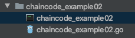

# chaincode-docker-devmode
하이퍼레저에서 제공하는 `fabric-sample` 에 포함된 docker 를 활용한 체인코드 개발 환경 입니다.   
공식 문서를 토대로 쉽게 설정할 수 있도록 재구성 했습니다.   
https://hyperledger-fabric.readthedocs.io/en/release-1.4/peer-chaincode-devmode.html

## 시스템 환경
* Hyperledger v1.4
* Go 1.14
* docker
* docker-compose 

자세한 버전은 하이퍼레저 공식 문서를 확인 해 주세요.   
https://hyperledger-fabric.readthedocs.io/en/release-1.4/prereqs.html

## Chaincode
`fabric-samples/chaincode/` 디렉토리에 포함된 샘플 체인코드들 중 `chaincode_example02` 를 활용 했습니다. 

## 적용 방법
1. 하이퍼레저 네트워크를 실행 합니다.
```shell script
$ docker-compose -f docker-compose-simple.yaml up -d
```
```shell script
Creating network "chaincode-docker-devmode_default" with the default driver
Creating orderer ... done
Creating peer    ... done
Creating chaincode ... done
Creating cli       ... done
```
2. 도커 컨테이너가 잘 실행되었는지 확인 합니다.
```shell script
$ docker ps
```
아래와 같이 네 가지의 컨테이너가 모두 실행되어야 합니다.
```shell script
CONTAINER ID        IMAGE                        COMMAND                  CREATED             STATUS              PORTS                                            NAMES
beb42a603ab7        hyperledger/fabric-ccenv     "/bin/sh -c 'sleep 6…"   3 minutes ago       Up 3 minutes                                                         chaincode
14c145c91ea3        hyperledger/fabric-tools     "/bin/bash -c ./scri…"   3 minutes ago       Up 3 minutes                                                         cli
ab7d48c1abf1        hyperledger/fabric-peer      "peer node start --p…"   3 minutes ago       Up 3 minutes        0.0.0.0:7051->7051/tcp, 0.0.0.0:7053->7053/tcp   peer
f6f25747239b        hyperledger/fabric-orderer   "orderer"                3 minutes ago       Up 3 minutes        0.0.0.0:7050->7050/tcp                           orderer
```
3. 컨테이너가 모두 제대로 실행 중이라면, 먼저 `chaincode` 컨테이너로 접속 합니다. 이 컨테이너 내부에서 체인코드를 빌드하고 실행시킵니다.
```shell script
$ docker exec -it chaincode bash
```
4. build 스크립트를 실행하여 체인코드를 빌드 합니다. 
```
# ./build.sh
```
스크립트 실행 후, 다음과 같은 에러가 난다면 `chmod` 명령어로 권한을 변경합니다.
```
# bash: ./build.sh: Permission denied
# chmod 777 build.sh                        # 권한 변경
```
정상적으로 실행된다면 아무런 결과내용 없이 약 10초 후에 커서가 돌아옵니다.
```
# ./build.sh
.
.
#
```
5. 빌드가 끝나면 다음과 같이 패키징된 파일이 생성됩니다.   
   

6. 파일을 실행하여 내부에서 해당 체인코드의 컨테이너를 실행합니다. (하이퍼레저 네트워크에서는 peer 가 chaincode 도커 컨테이너를 실행 시킵니다.)
```
# ./start.sh
```
스크립트 파일을 실행하면 다음과 같이 체인코드가 실행되고 체인코드를 호출할 때 여기에 로그가 찍힙니다. 이 상태로 그대로 둡니다.
```shell script
2020-07-28 08:20:56.822 UTC [shim] setupChaincodeLogging -> INFO 001 Chaincode log level not provided; defaulting to: INFO
2020-07-28 08:20:56.823 UTC [shim] setupChaincodeLogging -> INFO 002 Chaincode (build level: ) starting up ...
2020-07-28 08:20:56.824 UTC [bccsp] initBCCSP -> DEBU 001 Initialize BCCSP [SW]
2020-07-28 08:20:56.826 UTC [grpc] DialContext -> DEBU 002 parsed scheme: ""
2020-07-28 08:20:56.828 UTC [grpc] DialContext -> DEBU 003 scheme "" not registered, fallback to default scheme
2020-07-28 08:20:56.828 UTC [grpc] watcher -> DEBU 004 ccResolverWrapper: sending new addresses to cc: [{peer:7052 0  <nil>}]
2020-07-28 08:20:56.828 UTC [grpc] switchBalancer -> DEBU 005 ClientConn switching balancer to "pick_first"
2020-07-28 08:20:56.831 UTC [grpc] HandleSubConnStateChange -> DEBU 006 pickfirstBalancer: HandleSubConnStateChange: 0xc0001fc010, CONNECTING
2020-07-28 08:20:56.842 UTC [grpc] HandleSubConnStateChange -> DEBU 007 pickfirstBalancer: HandleSubConnStateChange: 0xc0001fc010, READY
```
7. 다른 터미널창을 하나 더 엽니다. 이 터미널창에서는 `cli` 도커 컨테이너로 접속 해, 앞서 실행한 체인코드를 install & instantiate 하고 invoke 또는 query 합니다.
```shell script
$ docker exec -it cli bash
```
8. 먼저 install 쉘 파일을 실행하여 체인코드를 install 합니다.
```
# ./install.sh
```
성공적으로 install 이 완료되면 상태코드 200 과 OK 라는 메시지가 떨어집니다.
```shell script
2020-07-28 08:29:23.411 UTC [chaincodeCmd] install -> INFO 04e Installed remotely response:<status:200 payload:"OK" >
```
9. 다음은 instantiate 을 진행합니다.
```
# ./instantiate.sh
```
instantiate 도 완료되었습니다.
```shell script
2020-07-28 09:03:57.552 UTC [chaincodeCmd] checkChaincodeCmdParams -> INFO 049 Using default escc
2020-07-28 09:03:57.555 UTC [chaincodeCmd] checkChaincodeCmdParams -> INFO 04a Using default vscc
2020-07-28 09:03:57.557 UTC [msp.identity] Sign -> DEBU 04b Sign: plaintext: 0AC9070A6108031A0C08FDD3FFF80510...30300A000A04657363630A0476736363 
2020-07-28 09:03:57.558 UTC [msp.identity] Sign -> DEBU 04c Sign: digest: F599AEFB4CC413976C891A9E5C507A118AA201AD1564CA99D7501CF60BFD05BE 
2020-07-28 09:03:57.594 UTC [msp.identity] Sign -> DEBU 04d Sign: plaintext: 0AC9070A6108031A0C08FDD3FFF80510...A6F9BE86F917A8FB215590FE6C8E1702 
2020-07-28 09:03:57.595 UTC [msp.identity] Sign -> DEBU 04e Sign: digest: CF7BDEF27FD0AA258623945319B522FC2D9206B0732533AB88FE723D0ED1992A
```
10. 이제 설치된 체인코드의 `invoke` 함수를 호출하여 데이터를 넣고 트랜잭션을 전송 합니다.
```
# peer chaincode invoke -n mycc -c '{"Args":["invoke","a","b","10"]}' -o orderer:7050 -C myc
```
결과(성공)
```shell script
2020-07-28 09:05:13.482 UTC [chaincodeCmd] chaincodeInvokeOrQuery -> INFO 04e Chaincode invoke successful. result: status:200
```
11. invoke 한 데이터를 조회 해보도록 합니다.
```shell script
peer chaincode query -n mycc -c '{"Args":["query","a"]}' -o orderer:7050 -C myc
```
결과(성공)
```shell script
90
```
## Chaincode Log
이러한 과정은 앞서 체인코드를 실행한 `chaincode` 도커 컨테이너 터미널창의 체인코드 로그를 통해 호출한 내용을 확인할 수 있습니다.
```shell script
ex02 Init
Aval = 100, Bval = 200
ex02 Invoke
Aval = 90, Bval = 210
ex02 Invoke
Query Response:{"Name":"a","Amount":"90"}
```
## Conclusion
체인코드를 수정하고 네트워크에 적용할때에는, install & instantiate 를 다시 할 필요없이 다시 `build` 하고 `start` 만 하면 수정된 내용이 반영 되어서 비교적 간단하게 테스트할 수 있습니다.
